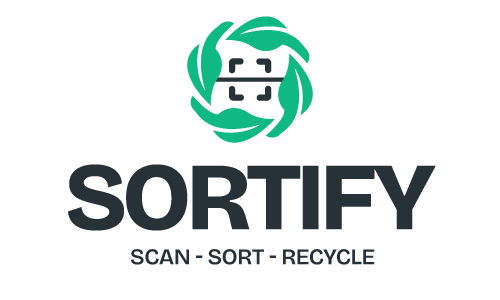
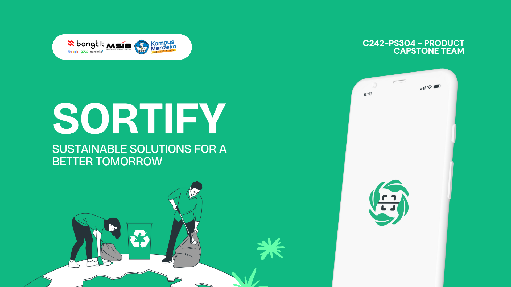
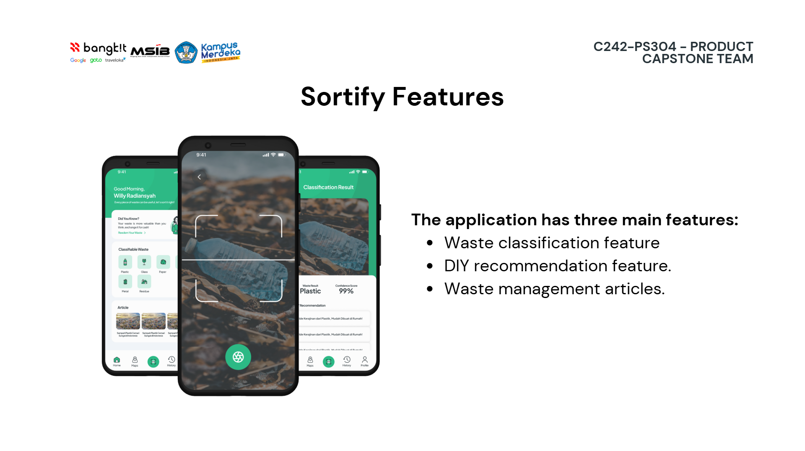

  

# ♻️ C242-PS304 - Bangkit 2024 Batch 2 Capstone Team Project (Sortify)

> Empowering better waste management through AI-powered classification and creative recycling ideas.

---

## 📖 Project Overview

Sortify is a mobile application that helps users identify and sort waste simply by scanning it.  
Using **Machine Learning**, the app can automatically classify waste (e.g., organic, inorganic, plastic, glass, metal) and provide **DIY craft recommendations** to creatively reuse materials.

The project is built by leveraging three main components:
1. **Machine Learning** – Waste image classification model (MobileNetV2) with data augmentation and cloud deployment.
2. **Mobile Development** – Kotlin-based Android app with intuitive UI/UX, authentication, and API integration.
3. **Cloud Computing** – Google Cloud-powered backend for storing user data, deploying ML model APIs, and ensuring scalable performance.

---

## 🌍 Why It Matters

Waste management remains a critical issue in Indonesia. Many households still mix different types of waste, leading to inefficient recycling and increased landfill usage.  
Sortify aims to:
- Improve public awareness of proper waste sorting.
- Encourage sustainable habits through recycling ideas.
- Support waste collection systems for better environmental impact.

---

## ✨ Features
- 📷 **Waste Classification** – Scan waste and get instant type recognition.  
- 🛠 **DIY Craft Recommendations** – Creative reuse ideas tailored to the scanned item.  
- 📚 **Waste Management Articles** – Educational content on recycling and sustainability.  
- 🔒 **Secure Authentication** – Registration, login, and password recovery.  
- ☁ **Cloud Integration** – Fast, reliable, and scalable backend.

---

## 🛠 Tech Stack
**Machine Learning**
- MobileNetV2 (transfer learning)
- TensorFlow / Keras
- Python & Flask API
- Google Cloud Storage & Cloud Run

**Mobile Development**
- Kotlin
- Retrofit (API calls)
- Firebase Authentication
- Material Design UI

**Cloud Computing**
- Node.js Backend API
- Firestore NoSQL Database
- Google Cloud Pricing Calculator for cost estimation
- Google Cloud Run for backend & ML API deployment

---

📄 Documentation & Resources

- 📜 [Sortify Machine Learning API Documentation](https://github.com/Sortify-Scan-App/sortify-model-api)
- 🤖 [Sortify ML Model](https://github.com/Sortify-Scan-App/sortify-model-classification)
- ☁️ [Sortify Cloud Computing & Backend Documentation](https://github.com/Sortify-Scan-App/sortify-cloud-backend)
- 📱 [Sortify Mobile Development Documentation](https://github.com/Sortify-Scan-App/sortify-mobile)
- 🎨 [Sortify UI/UX Design](https://github.com/)

---

## 🚀 Project Branches

We've divided our project into distinct branches to ensure smooth development and organization. Here's a glimpse into each branch:

- **Machine Learning:** This branch focuses on developing the cutting-edge computer vision and machine learning algorithms that enable fruit identification from images

- **Mobile Android Development:** Here, we're crafting an intuitive and user-friendly Android application for our project.

- **Cloud Computing:** In this branch, you'll find the powerful backend code that enables seamless communication and data processing.

---

## 👥 Team

Let us introduce you to the masterminds behind this groundbreaking project. Each team member brings their unique expertise, unwavering dedication, and a shared passion for making a real impact.

| Learning Path                         | Bangkit ID    | GitHub Link                | LinkedIn Link                          |
|------------------------------|---------------|-----------------------|-----------------------------------|
| Machine Learning        | M004B4KY0068   | [Adam Dirham](https://github.com/) | [Adam Dirham](https://www.linkedin.com/in/)      |
| Machine Learning             | M303B4KX1437   | [Fatih Durrotul Jannah](https://github.com/) | [Fatih Durrotul Jannah](https://www.linkedin.com/in/)      |
| Machine Learning             | M394B4KY3058   | [Muhammad Rizki Malik Aziz](https://github.com/Rizki-Malik) | [Muhammad Rizki Malik Aziz](https://www.linkedin.com/in/)      |
| Mobile Development      | A476B4KY3022   | [Muhammad Ramadhan](https://github.com/) | [Muhammad Ramadhan](https://linkedin.com/in/)      |
| Mobile Development | A171B4KY4237   | [Sutanto Dwi Putra](https://github.com/Sutanto-dev) | [Sutanto Dwi Putra](https://www.linkedin.com/in/sutanto-dwi-putra)      |
| Cloud Computing    | C248B4KY3963   | [Ronald Cahya](https://github.com/) | [Ronald Cahya](https://www.linkedin.com/in/)      |
| Cloud Computing      | C171B4KY4491   | [Willy Radiansyah](https://github.com/Rinzeince) | [Willy Radiansyah](https://www.linkedin.com/in/Willy-Radiansyah)      |

---

## 📩 Contact Us

Have questions, ideas, or just want to say hello? Reach out to us through the following channels:

- Email: sortify.bangkit@gmail.com